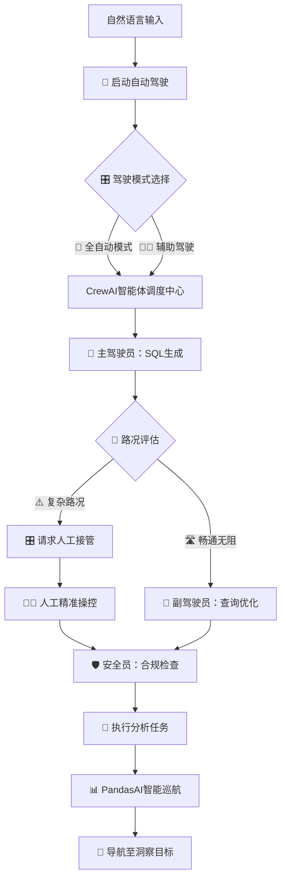

# 🚗 DataCrew AutoPilot - 数据分析自动驾驶系统

> **基于CrewAI+PandasAI的智能数据分析自动驾驶平台** - 让AI团队为您的数据分析保驾护航

[](https://www.python.org/downloads/)
[](https://streamlit.io/)
[](https://github.com/joaomdmoura/crewAI)
[](https://github.com/gventuri/pandas-ai)
[](LICENSE)

DataCrew AutoPilot 是一个革命性的**数据分析自动驾驶系统**，就像Tesla的自动驾驶一样，让AI智能体团队接管您的数据分析全流程。通过 **CrewAI多智能体协作** 和 **PandasAI智能可视化** 的完美融合，实现从自然语言输入到洞察输出的全程自动化，让数据分析真正进入"自动驾驶"时代。

## 🎬 系统演示

> **快速预览**：观看2倍速演示视频，1分34秒了解完整功能

https://github.com/brightbird/DataCrew-AutoPilot/raw/main/video/DataCrew-AutoPilot演示视频_2x.mp4

*📹 演示视频展示了从自然语言输入到智能分析输出的完整"自动驾驶"流程，包括AI智能体协作、人工干预、智能历史管理等核心功能。*

## ✨ 自动驾驶核心特性

### 🤖 AI驾驶员团队（CrewAI多智能体）
- **🧠 主驾驶员**：SQL生成智能体 - 理解需求，规划查询路线
- **👀 副驾驶员**：查询审查智能体 - 优化性能，确保行驶安全  
- **🛡️ 安全员**：合规检查智能体 - 监控风险，保障数据安全
- **📊 导航员**：业务分析智能体 - 解读结果，指引决策方向

### 🎯 智能巡航控制（PandasAI可视化）
- **🚗 自适应分析**：根据数据特征自动选择最佳可视化方案
- **🛣️ 智能路径规划**：从数据探索到洞察发现的最优分析路径
- **📡 实时路况感知**：动态识别数据趋势和异常模式
- **🎛️ 一键接管模式**：关键时刻支持人工干预调整

### 🚦 L4级自动驾驶体验
- **🎮 简单操控**：自然语言即可启动分析"自动驾驶"
- **📱 智能仪表盘**：实时显示分析进度和系统状态
- **🔄 自动泊车**：分析结果自动保存和历史管理
- **⚡ 紧急制动**：异常检测和安全防护机制

### 🛠️ 人工接管系统 ⭐ **驾驶辅助**
- **🚨 智能提醒**：系统检测到复杂场景时主动提示接管
- **🎛️ 无缝切换**：一键从自动模式切换到手动控制
- **📝 专业工具**：内置SQL编辑器，支持**智能格式化**，专业驾驶员的得力助手
- **🎨 格式化增强**：自动美化SQL代码，提升可读性和维护性
- **🔄 重新启航**：人工调整后可重新激活自动驾驶模式

## 🎯 自动驾驶架构



| 系统组件 | 技术引擎 | 版本 | 自动驾驶职能 |
|----------|----------|------|-------------|
| 🎮 驾驶舱界面 | Streamlit | 1.46+ | 用户交互和系统控制中心 |
| 🤖 AI驾驶团队 | CrewAI | 0.130+ | 多智能体协作的自动驾驶大脑 |
| 🧠 智能引擎 | 阿里云百炼 | qwen-plus | 自然语言理解和决策引擎 |
| 📊 智能巡航 | PandasAI | 3.0+ | 自适应数据分析和可视化 |
| 📈 显示系统 | Matplotlib/Plotly | Latest | 高清数据可视化显示屏 |
| 🗄️ 数据仓储 | SQLite | 内置 | 轻量级数据存储后备箱 |
| 🐍 驾驶平台 | Python | 3.8+ | 整个自动驾驶系统的底盘 |

## 🚀 开启自动驾驶之旅

### 1️⃣ 车辆准备

```bash
# 获取您的专属数据分析座驾
git clone https://github.com/brightbird/DataCrew-AutoPilot.git
cd DataCrew-AutoPilot

# 创建独立驾驶环境
python3 -m venv venv

# 激活驾驶模式
source venv/bin/activate  # Linux/Mac
# 或 venv\Scripts\activate  # Windows
```

### 2️⃣ 安装驾驶系统

```bash
# 安装所有自动驾驶组件
pip install -r requirements.txt

# 系统自检
python -c "import streamlit, crewai, pandasai; print('🚗 自动驾驶系统就绪')"
```

### 3️⃣ 激活AI驾驶员

**燃油加注（API密钥配置）**
```bash
export DASHSCOPE_API_KEY="your_api_key_here"
```

**或创建驾驶证文件**
```bash
echo "DASHSCOPE_API_KEY=your_api_key_here" > .env
```

> 🎫 **获取驾驶证**：访问 [阿里云百炼控制台](https://bailian.console.aliyun.com/) 获取免费API密钥

### 4️⃣ 启动自动驾驶

```bash
# 🚗 一键启动自动驾驶（推荐）
python run.py

# 或手动启动驾驶系统
streamlit run app.py
```

### 5️⃣ 开始数据分析之旅

浏览器自动打开 http://localhost:8501，体验L4级数据分析自动驾驶！

## 💡 自动驾驶使用场景

### 🛣️ 高速巡航场景
```
"自动分析2024年各产品线的销售表现"
"智能识别客户流失风险并生成预警报告" 
"自动生成月度经营数据看板"
"一键完成竞品分析和市场趋势预测"
```

### 🏙️ 城市驾驶场景
```
"为我的销售数据设计最佳可视化方案"
"自动发现异常订单并分析原因"
"智能推荐下一步分析方向"
"生成高管汇报用的数据故事"
```

### 🚧 复杂路况场景（人工接管）
```
🤖 AI检测：复杂业务逻辑，建议人工接管
👨‍💻 专家操控：精细调整SQL逻辑和业务规则
🔄 重新启动：优化完成，恢复自动驾驶模式
```

## 🎨 驾驶舱预览

### 🏠 主控制台
- **🚗 启动按钮**：一键开启数据分析自动驾驶
- **🎛️ 模式切换**：自动/辅助驾驶模式快速切换  
- **📊 仪表盘**：实时显示分析进度和系统状态
- **⚠️ 接管提醒**：智能识别复杂场景并提示介入

### 🗂️ 智能历史管理
- **📚 状态识别**：自动识别查询状态（✅ 完成、❌ 失败、⏳ 进行中）
- **🎯 智能折叠**：默认折叠已完成查询，保持界面整洁
- **⚡ 快速操作**：一键归档、重新执行、复制、置顶、删除
- **📊 统计面板**：实时显示总查询数、完成数、进行中数量
- **🔄 无缝切换**：查询完成后自动准备新查询，工作流顺畅

### 📱 智能助手
- **🗂️ 智能归档**：自动管理查询历史，智能折叠已完成查询
- **🔄 历史轨迹**：查看和重播历史分析路径，一键重新执行
- **💡 路线推荐**：AI推荐最佳分析路线
- **📈 性能监控**：系统性能和成本实时追踪
- **🎯 目标导航**：智能规划达成业务目标的路径

## 🏗️ 自动驾驶系统架构

```
DataCrew-AutoPilot/
├── 📚 使用手册
│   ├── README.md                     # 自动驾驶用户手册
│   ├── STRUCTURE.md                  # 系统架构说明书
│   ├── MANUAL_INTERVENTION_GUIDE.md  # 人工接管操作指南
│   └── PROJECT_SUMMARY.md            # 项目开发日志
├── 🚗 驾驶系统
│   ├── run.py                        # 一键启动自动驾驶
│   ├── app.py                        # 主驾驶舱界面
│   ├── main.py                       # 快速测试驾驶
│   └── crew_setup.py                 # AI驾驶员配置
├── 🧠 智能大脑
│   └── config/
│       ├── agents.yaml               # AI驾驶员团队配置
│       └── tasks.yaml                # 自动驾驶任务流程
├── 🛠️ 驾驶工具
│   └── utils/
│       ├── db_simulator.py           # 数据源管理器
│       ├── helper.py                 # 驾驶辅助工具
│       └── pandasai_helper.py        # 智能巡航引擎
├── 🗄️ 数据仓库
│   └── data/
│       └── sample_db.sqlite          # 演示数据集
└── 📊 输出中心
    ├── charts/                       # 自动生成的分析图表
    └── exports/                      # 导出的分析报告
```

## 🔧 驾驶模式配置

### 🌐 AI引擎配置
- ✅ **阿里云百炼**（推荐）- 性能稳定，成本可控的智能引擎
- ✅ **OpenAI GPT**系列 - 全球领先的AI驾驶大脑
- ✅ **其他兼容引擎** - 支持OpenAI协议的第三方服务

### 🗄️ 数据源支持
- ✅ **SQLite**（默认）- 轻量级，即插即用
- 🔄 **MySQL**（开发中）- 企业级数据高速公路
- 🔄 **PostgreSQL**（规划中）- 高性能分析专用道
- 🔄 **ClickHouse**（规划中）- 大数据分析超级高速路

## 🤝 加入自动驾驶生态

### 🎯 参与方式
- 🐛 **Bug修复**：帮助完善自动驾驶安全性
- 💡 **功能建议**：提出新的驾驶场景需求
- 📝 **文档优化**：完善驾驶手册和教程
- 💻 **代码贡献**：开发新的自动驾驶功能
- 🎨 **界面设计**：优化驾驶舱用户体验
- 🧪 **测试场景**：增加复杂路况测试用例

## 📄 开源协议

本项目基于 [MIT License](LICENSE) 开源协议。

## 🌟 技术致谢

感谢以下开源项目为数据分析自动驾驶提供技术支撑：
- [CrewAI](https://github.com/joaomdmoura/crewAI) - 多智能体协作的自动驾驶大脑
- [PandasAI](https://github.com/gventuri/pandas-ai) - 智能数据分析巡航系统
- [Streamlit](https://streamlit.io/) - 现代化数字驾驶舱
- [阿里云百炼](https://bailian.console.aliyun.com/) - 高性能AI引擎

## 🎉 版本里程碑

### v1.3.0 Smart Archive Edition（当前）
- 🗂️ **智能历史归档**：完善的查询历史管理和归档系统
- 🎯 **状态智能识别**：自动识别查询状态并智能折叠
- ⚡ **快速操作面板**：一键归档、重新执行、复制等便捷操作
- 🔄 **无缝工作流**：查询完成后自动准备新查询

### v1.2.0 SQL Enhancement Edition
- 🚗 **完整自动驾驶**：端到端的智能数据分析流程
- 🎛️ **人工接管系统**：复杂场景下的专业驾驶员介入
- 📊 **智能巡航**：基于PandasAI的自适应可视化
- 🛡️ **安全防护**：全方位的数据安全和合规保障

---

<div align="center">
  <b>🚗 开启您的数据分析自动驾驶之旅！</b>
  <br><br>
  <i>让AI智能体团队为您的数据分析保驾护航</i>
  <br><br>
  <a href="https://github.com/brightbird/DataCrew-AutoPilot/stargazers">⭐ 收藏座驾</a> |
  <a href="https://github.com/brightbird/DataCrew-AutoPilot/fork">🚗 获取副本</a> |
  <a href="https://github.com/brightbird/DataCrew-AutoPilot/issues">🔧 报告故障</a> |
  <a href="https://github.com/brightbird/DataCrew-AutoPilot/issues">💡 功能建议</a>
</div>
