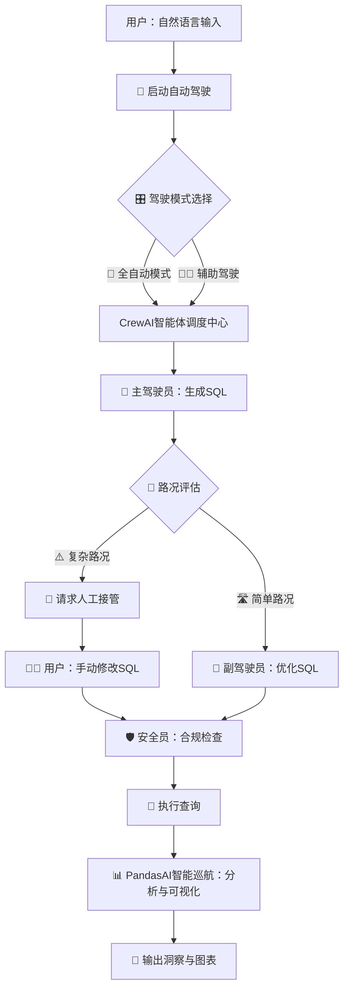
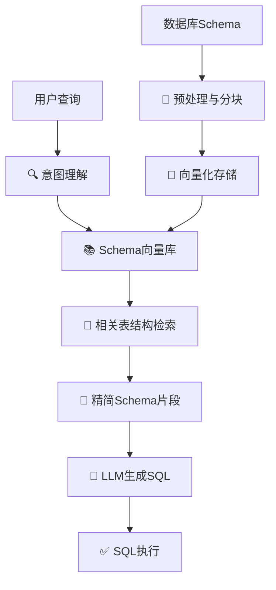

# 基于CrewAI和PandasAI实现数据分析「自动驾驶」

大家好！👋

今天想和大家分享一个我最近在捣鼓的开源项目——**DataCrew AutoPilot**。你是否曾幻想过，数据分析能像特斯拉开启「自动驾驶」一样，输入一个目的地（你的分析需求），然后系统就能自动完成数据处理、分析、可视化，最后把洞察报告呈现在你面前？

这个项目就是为了实现这个梦想而诞生的。我们希望通过结合强大的 **CrewAI** 多智能体协作框架和 **PandasAI** 智能数据分析库，打造一个真正意义上的**数据分析「自动驾驶」系统**。

## 🎬 系统演示视频

> **1分34秒快速了解完整功能** - 2倍速演示视频

https://github.com/brightbird/DataCrew-AutoPilot/raw/main/video/DataCrew-AutoPilot演示视频_2x.mp4

*📹 演示视频展示了完整的"自动驾驶"数据分析流程：自然语言输入 → AI智能体协作生成SQL → 智能审查优化 → 人工干预调整 → 自动执行分析 → 智能可视化输出 → 历史管理归档*

## 🤯 背景：数据分析的「驾驶疲劳」

在数字化时代，我们每个人或多或少都会与数据打交道。但传统的数据分析流程，往往充满了「驾驶疲劳」：

*   **重复劳动**：每天、每周都要制作类似的报表，手动执行SQL、导出数据、用Excel或BI工具拖拽图表，枯燥且效率低下。
*   **技术门槛高**：不懂SQL、Python的业务同学，很难从数据中快速获得想要的答案，只能依赖数据分析师排期。
*   **协作链路长**：一个分析需求，可能需要业务、数据分析师、数据工程师、合规等多个角色参与，沟通成本高，响应速度慢。
*   **洞察发现难**：面对海量数据，如何快速找到有价值的趋势、异常和洞察，非常考验分析师的经验和精力。

我们不禁思考：能不能让AI来分担这些繁重的工作？就像汽车的自动驾驶，我们需要的不是一个又一个独立的辅助工具，而是一个能够整合和调度这些工具，**自主完成端到端任务**的智能系统。

## ✨ 效果预览：L4级数据分析体验

DataCrew AutoPilot的目标就是提供L4级的自动驾驶体验。用户只需要通过自然语言下达指令，AI智能体团队就会接管后续的一切。

**驾驶舱主界面** 👇

 *（请替换为应用截图）*

- **简单操控**：在对话框输入分析需求，如"分析一下2024年各产品线的销售表现"，然后点击「启动分析」。
- **智能仪表盘**：系统会实时显示分析进度，当前是哪个AI智能体在工作，以及它的思考过程和输出。
- **模式切换**：支持「全自动」和「辅助驾驶」模式。在复杂场景下，系统会主动提醒你进行「人工接管」，让你在关键时刻能精准操控。

**智能可视化与洞察** 👇

AI不仅会自动编写SQL查询数据，还会利用PandasAI自动选择最合适的可视化图表，并生成初步的分析结论。

```
"为我分析各产品的销售额占比"
```

AI会自动生成一个漂亮的饼图，并告诉你哪个产品是销售冠军。系统不仅能根据数据特征智能选择最合适的**生成图表**（柱状图、折线图、饼图等），还会提供深度的**数据洞察**（趋势识别、异常检测、业务建议），支持**智能问答**让你与数据自然对话，甚至会主动推荐**建议问题**引导你发现更多有价值的分析角度，真正实现从"人找答案"到"答案找人"的智能分析体验。

 *（请替换为图表示例）*

## 🤔 问题思考：如何打造AI分析团队？

要实现真正的「自动驾驶」，光有一个强大的大模型（LLM）是不够的。就像开车一样，需要司机、导航员、安全员等多个角色协同工作。数据分析也是如此，它是一个复杂的流程，需要不同的专业技能。

因此，我们引入了 **CrewAI** 框架，它能让我们组建一个AI智能体（Agent）团队，每个成员都有自己明确的角色和工具：

- **🧠 主驾驶员 (SQL生成智能体)**：团队的核心，负责理解用户的自然语言需求，并将其转化为精确的SQL查询语句。
- **👀 副驾驶员 (查询审查智能体)**：像一个经验丰富的代码审查员，负责检查和优化主驾驶员生成的SQL，确保查询的性能和准确性。
- **🛡️ 安全员 (合规检查智能体)**：确保所有数据操作都符合规范，防止数据泄露或误用，是数据安全的守护者。
- **📊 导航员 (业务分析智能体)**：负责解读查询结果，从中提炼出业务洞察，并将技术性的数据转化为通俗易懂的结论。

这个团队协同工作，模拟了真实世界中数据分析团队的工作流，让AI能够处理更复杂的、多步骤的分析任务。

## 🛠️ 实现方案设计：自动驾驶系统架构

整个系统的架构设计紧紧围绕"自动驾驶"这一核心理念。



1.  **驾驶舱 (Streamlit)**：我们使用 `Streamlit` 构建了交互界面，它既是用户输入指令的"方向盘"，也是展示分析结果的"仪表盘"。

2.  **AI驾驶团队 (CrewAI)**：这是系统的"大脑"。我们通过 `agents.yaml` 和 `tasks.yaml` 文件来定义上面提到的AI智能体团队的角色、背景故事、任务和可用工具。这种配置化的方式让我们可以很灵活地调整和扩展团队。

3.  **智能Schema管理**：针对复杂数据库架构，我们正在开发智能的Schema管理系统。它能够根据用户查询意图，智能筛选相关的表结构信息，避免将整个数据库schema传递给LLM，从而优化性能和成本。

4.  **智能巡航 (PandasAI)**：当SQL查询出数据后，我们将其交给 `PandasAI`。它就像车辆的"自适应巡航系统"，能根据数据特征，自动完成数据清洗、分析和可视化，大大简化了从数据到图表的过程。

5.  **人工接管 (Manual Intervention)**：这是我们认为非常重要的一个功能。AI不是万能的，总会遇到它无法理解的复杂业务逻辑。此时，系统会**主动暂停**，并请求用户介入。用户可以在内置的SQL编辑器中，亲自修改SQL，然后将控制权交还给AI团队，继续完成后续的分析。这确保了系统的实用性和可靠性。

## 🚀 结论与展望

通过将 CrewAI 的多智能体协作与 PandasAI 的智能数据处理能力相结合，DataCrew AutoPilot 项目成功地构建了一个数据分析「自动驾驶」系统的雏形。它不仅降低了数据分析的技术门槛，也为自动化处理复杂分析任务提供了一种全新的思路。

当然，目前的系统还处于早期阶段，未来我们还有很多激动人心的计划：

-   **支持更多数据源**：正在开发对 `MySQL` 的支持，后续会逐步接入 `PostgreSQL`、`ClickHouse` 等企业级数据仓库。
-   **更强的分析能力**：引入更复杂的分析模型，实现趋势预测、异常检测等高级功能。
-   **更智能的人机交互**：让AI能够进行多轮对话，澄清模糊需求，甚至主动提出分析建议。

## 🔍 技术挑战与解决方案

在实际的企业环境中，我们面临着更多复杂的技术挑战：

### 📊 复杂数据库架构的挑战

现实中的数据库往往极其复杂，包含数百甚至数千张表，每张表都有几十个字段。如果将整个数据库schema直接传递给LLM，会遇到以下问题：

- **Token限制**：完整的schema可能超过LLM的上下文窗口限制
- **成本问题**：传递大量无关的schema信息会显著增加API调用成本
- **准确性下降**：过多的信息会干扰LLM的判断，降低SQL生成的准确性

### 🧠 RAG技术的智能解决方案

为了解决这些挑战，我们计划引入**RAG（Retrieval Augmented Generation）**技术：



**核心技术策略**：

1. **智能Schema检索**：
   - 将数据库schema按表、字段进行向量化存储
   - 根据用户查询意图，智能检索最相关的表结构
   - 只将相关的schema片段传递给LLM，大幅减少token消耗

2. **智能体记忆优化**：
   - 为每个AI智能体配置专门的工作记忆
   - 缓存常用的表结构和查询模式
   - 实现渐进式学习，提高处理效率

3. **智能缓存机制**：
   - 缓存相似查询的结果，避免重复的API调用
   - 实现查询模式识别，预测用户可能的下一步需求
   - 建立查询优化历史，持续改进SQL生成质量

### 🚀 企业级部署考虑

针对企业级应用，我们还将重点关注：

- **数据隐私保护**：支持本地部署，确保敏感数据不离开企业环境
- **权限管理**：细粒度的数据访问控制，确保用户只能访问授权的数据
- **性能优化**：支持分布式查询，处理大规模数据集
- **监控与审计**：完整的操作日志，满足合规要求

我们相信，未来的数据分析将不再是少数人的专利，而是像开车一样，成为人人都能轻松掌握的技能。AI将成为我们最得力的"数据分析驾驶员"。

---

如果你对这个项目感兴趣，或者也想体验一下数据分析的「自动驾驶」，欢迎访问我们的GitHub仓库！

🔗 **项目地址**: [https://github.com/brightbird/DataCrew-AutoPilot](https://github.com/brightbird/DataCrew-AutoPilot)

给它一个 ⭐ Star，就是对我们最大的鼓励！也欢迎大家提出宝贵的意见（Issues）或直接贡献代码（Pull Requests），一起打造更强大的数据分析自动驾驶系统！

感谢阅读！ 